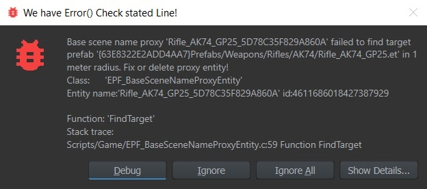

# Baked map entities
"Baked" map entities are those which are placed automatically by the game as part of the `.layer` files of the loaded world. They always spawn and are usually in the same position, but they can move sometimes too.  
Not all baked entities are interesting to persistence (e.g. trees and rocks usually don't have any state to persist) but this can change for things like houses or manager entities put onto the map.

The framework supports saving and loading data for them and offers a few tricks to uniquely identify them and reduce the save-data sizes for what are often untouched objects.

## Identification
Baked entities are identified in one of two ways.

### ID by name
The least error-prone way is by name. Any entity placed in the world on editable layers (not external mods or base game) will automatically force assign a name if the user does not enter one for the entity. The name allows the entity to be moved or even have an entirely different prefab while the persistence data can still be associated with it.

#### Base scene name proxy
One helpful utility to profit from the flexibility of naming for situations where the world editor does not allow it otherwise is through the [`EPF_BaseSceneNameProxyEntity`](https://enfusionengine.com/api/redirect?to=enfusion://ScriptEditor/Scripts/Game/EPF_BaseSceneNameProxyEntity.c;6). They can be spawned by right-clicking on a persistence component of an entity that is in a locked parent scene and choosing `Spawn new base scene name proxy`. This will automatically place a new proxy object at the position and on your current active editable layer and assign the autogenerated name to it (1), that would have been put onto the proxy target normally. This name can then be changed if desired.

It is also possible from the proxy to jump back to the target in situations where selecting objects occluded by others becomes difficult (2). In the below on (3) the target is configured via the prefab. It looks for the closest occurrence of it nearby.

In situations where the parent scene changes (e.g. big game or mod update) and the proxy no longer aligns with its target an error message like this can be seen. **Do not ignore those. All of them must be resolved!**.

There are two ways of fixing them (4). First, try to auto-fix the proxy. This will look for the nearest prefab match but in a bigger radius. For all slight terrain adjustments, this will do the job.

Should however the object be moved e.g. 100 meters away the proxy can be "remembered". Then enable entity selection from all layers (not just the currently active one) in the world editor and go to the target and choose assign (5). This will teleport the proxy where it needs to be (at the origin of the target).

### ID by prefab and position
Alternatively if one does not want to go around assigning proxies to maybe 100 different special prefabs placed all over the map but still persist something about them, the fallback is that their prefab and position build a unique hash that remains the same as long as they are not moved. This breaks on the ever-smallest movement during map changes and there is some ideas to make this more resilient, but for the time being expect their save-data to be fragile. The database however is cleared of any baked entity save-data entries that can no longer be found in the world so there is no fear of DB clutter caused by this.
